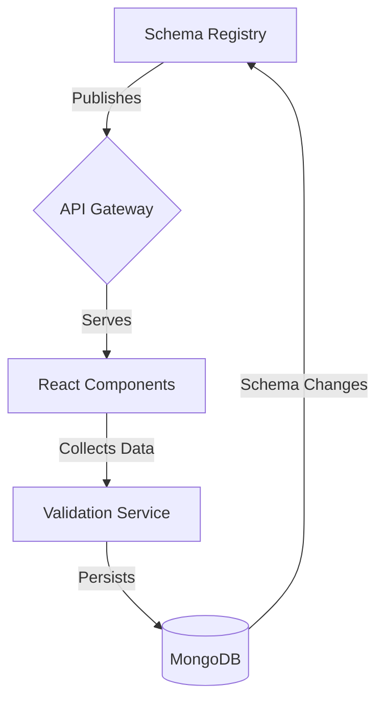

# Schema Evolution Framework
**Technical Stack**  
✅ Frontend: Refine (React) + TypeScript  
✅ Backend: FastAPI + Pydantic  
✅ Database: MongoDB (With Schema Versioning)

## Value Proposition
### Problem vs Solution
| Challenge              | Traditional Approach            | Our Solution              |
|------------------------|----------------------------------|---------------------------|
| Schema Modifications   | Manual updates across UI/API/DB | Single declarative source |
| UI Inconsistency       | Fragmented component definitions| Schema-driven rendering   |
| Validation Fatigue     | Duplicated validation rules     | Central validation engine |
| Deployment Risk        | Big-bang migrations             | Gradual version rollout   |

## Architectural Blueprint


## Core Implementation Strategy

### 1. Schema Definition (Backend)
```python
# Declarative document model
class ContentDocument(Document):
    # Version control
    schema_version: int = 1
    
    # Core metadata (stable)
    title: str <5-100 characters>
    status: "draft" | "published" | "archived"
    
    # Flexible content area
    content: {
        # Version-aware formats
        markdown?: string @v1
        blocks?: Block[] @v2
    }
    
    # UI rendering hints
    ui_config: {
        list_view: ["title", "status", "content.preview"],
        form_layout: {
            "content.markdown": "RichTextEditor",
            "status": "DropdownPicker"
        }
    }
```

### 2. Frontend Adaptation Layer
```typescript
// Dynamic table component
function SchemaDrivenTable({ collection }) {
  const { schema } = useSchema(collection);
  
  return (
    <Table>
      {schema.ui_config.list_view.map(field => (
        <Column
          title={humanize(field)}
          render={(value) => (
            <SchemaRenderer 
              type={detectType(value)}
              config={schema.ui_config.form_layout[field]}
            />
          )}
        />
      ))}
    </Table>
  );
}
```

## Change Management Process

### Adding New Field
1. **Backend Schema Update**
   ```python
   class ContentDocument(Document):
       seo_tags: List[str] = []  # Add new field
       ui_config: {
           form_layout: {
               "seo_tags": "TagInput"  # Configure UI
           }
       }
   ```
   
2. **Frontend Propagation**
   ```mermaid
   sequenceDiagram
       Frontend->>API: GET /schema/content
       API-->>Frontend: { ..., "seo_tags": "TagInput" }
       Frontend->>Cache: Invalidate schema
       Frontend->>UI: Re-render components
   ```

3. **Data Migration**
   ```python
   # Gradual backfill
   for doc in ContentDocument.find(schema_version=1):
       doc.seo_tags = generate_seo_tags(doc)
       doc.schema_version = 2
       doc.save()
   ```

### Modifying Existing Field
1. **Versioned Schema Update**
   ```python
   class ContentDocument(Document):
       schema_version: int = 2  # Bump version
       title: str <5-120 characters>  # Extended length
   ```

2. **Multi-Version Support**
   ```python
   # Data access layer
   def get_document(id: str) -> ContentDocument:
       doc = mongodb.find(id)
       if doc.schema_version < 2:
           return migrate_v1_to_v2(doc)
       return doc
   ```

## Quality Assurance

### Validation Layers
| Layer          | Scope                          | Tools                |
|----------------|--------------------------------|----------------------|
| Client-Side    | Input formatting & basic rules| Zod/JSON Schema      |
| API            | Business logic & relationships| Pydantic validators  |
| Database       | Data integrity & constraints  | MongoDB JSON Schema  |

### Monitoring Safeguards
```python
# Health checks
alert_on(
    unmigrated_docs > 100,
    schema_version_distribution['v1'] > 5%,
    validation_errors.spike(50%)
)
```


